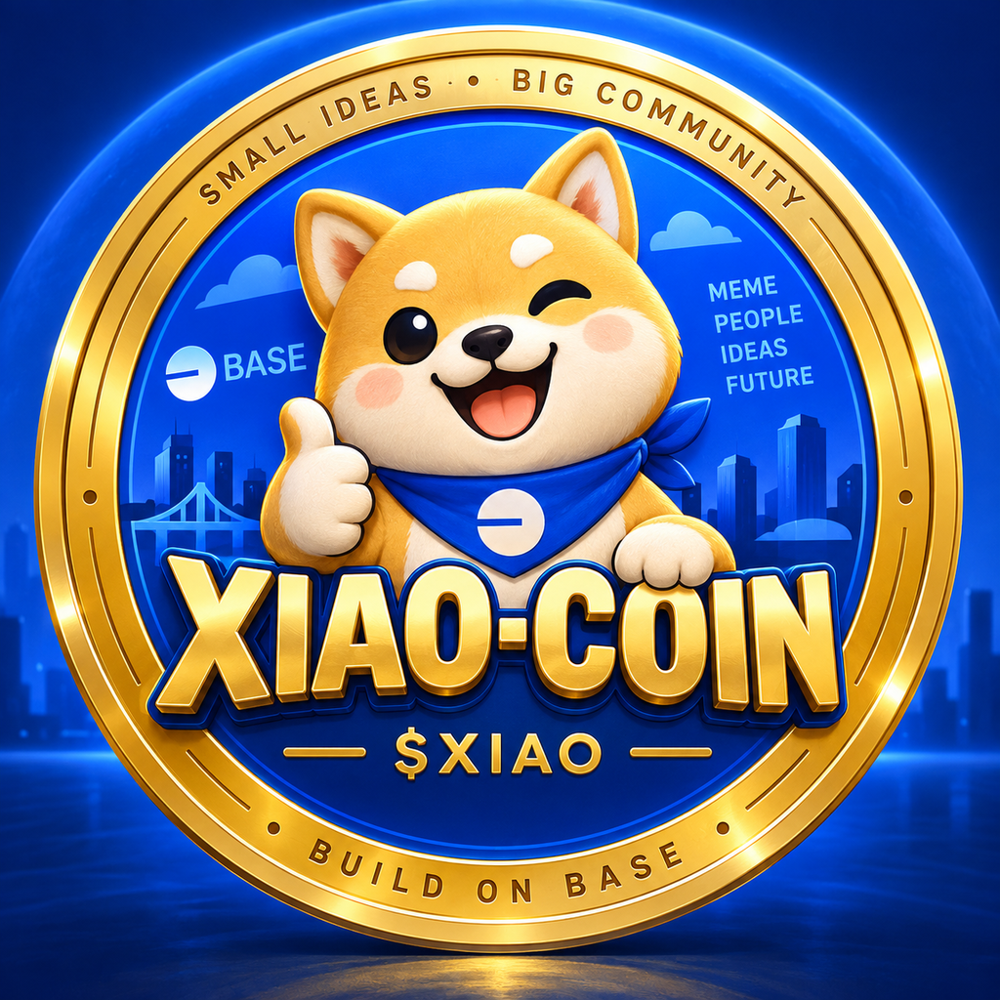

<p align="center">
  
</p>

<h1 align="center">Xiao-Coin ($XIAO)</h1>

<p align="center">
  <strong>Small ideas. Big community.</strong><br />
  A community-driven meme coin built on Base.
</p>

<p align="center">
  <a href="https://base.meme/coin/base:0xc62792b29E6aDbc179e47DAfCe159119bb918888"><strong>Trade / view on Base.meme</strong></a>
  ·
  <a href="https://basescan.org/token/0xc62792b29E6aDbc179e47DAfCe159119bb918888">Verify on BaseScan</a>
  ·
  <a href="README.zh-CN.md">中文说明</a>
</p>

> [!IMPORTANT]
> The only official Xiao-Coin contract address is
> **`0xc62792b29E6aDbc179e47DAfCe159119bb918888`** on **Base Mainnet (chain ID 8453)**.
> Token names and tickers can be copied. Always verify the complete address before interacting.

## About Xiao-Coin

Xiao-Coin ($XIAO) is a community-driven meme coin built on Base, bringing together internet culture, creativity, humor, and community participation. Small ideas, big community. XIAO is created for entertainment and community engagement, with no promise of profit or guaranteed value.

Xiao-Coin is live through the Base.meme launch platform. This repository is the
project's public information, brand, verification, safety, and community website
repository. It is **not** the deployed contract source repository and does not
replace onchain verification or Base.meme's live market page.

## Official token facts

| Item | Official information |
|---|---|
| Name | Xiao-Coin |
| Ticker | XIAO |
| Network | Base Mainnet |
| Chain ID | `8453` |
| Contract | `0xc62792b29E6aDbc179e47DAfCe159119bb918888` |
| Launch platform | Base.meme |
| Launch page | [Open Xiao-Coin on Base.meme](https://base.meme/coin/base:0xc62792b29E6aDbc179e47DAfCe159119bb918888) |
| Explorer | [Open token on BaseScan](https://basescan.org/token/0xc62792b29E6aDbc179e47DAfCe159119bb918888) |
| Launch mode | Base.meme Standard fair-launch model |
| Pair / raised token | ETH |
| Token tax setting | 0% at launch |
| Token standard | ERC-20 on Base |
| Total supply model | 1,000,000,000 XIAO under the Base.meme Standard model |
| Automatic creator allocation | None under the Standard model |
| Stablecoin | No |
| Profit guarantee | None |

## Official links

- **Base.meme:** https://base.meme/coin/base:0xc62792b29E6aDbc179e47DAfCe159119bb918888
- **BaseScan token page:** https://basescan.org/token/0xc62792b29E6aDbc179e47DAfCe159119bb918888
- **Contract address:** `0xc62792b29E6aDbc179e47DAfCe159119bb918888`

The repository does not list unofficial social accounts. Add X, Telegram, Discord,
or another website only after the project owner has created and verified them.

## How the launch works

Base.meme's Standard fair-launch model uses two stages:

1. **Bonding curve:** 800,000,000 XIAO are available through the curve. Price moves
   according to the platform's curve and net buying/selling activity.
2. **Liquidity phase:** 200,000,000 XIAO are reserved for the liquidity pool. After
   the platform's graduation conditions are reached, liquidity is migrated to a
   Uniswap V4 market and locked under Base.meme's current process.

The selected collateral / raised token is ETH and the launch page uses a 2.5 ETH
bonding-curve raising goal. These mechanics are platform rules, not promises made
by this repository. Platform parameters, fees, and reward rules can change; review
the live Base.meme page and documentation before every transaction.

## Creator holdings and rewards

Base.meme Standard launches do **not** automatically give the creator a free token
allocation. Any creator-held XIAO must come from a purchase or another onchain
transfer. This repository intentionally does not publish a creator balance because
wallet balances change and should be checked onchain.

Base.meme currently documents creator rewards tied to eligible trading activity.
Rewards are not guaranteed income, and rules may change. Review Base.meme's current
reward documentation and the onchain reward recipient before relying on them.

## Historical launch snapshot

A timestamped creator-provided Base.meme screenshot and clearly labeled historical values are preserved in [`docs/LAUNCH_SNAPSHOT.md`](docs/LAUNCH_SNAPSHOT.md). Live data must still be checked on Base.meme and BaseScan.

## Website included in this repository

The `web/` directory is a GitHub Pages-ready, non-custodial project site. It includes:

- the official logo and bilingual project introduction;
- canonical contract-address display and copy button;
- direct links to Base.meme and BaseScan;
- read-only onchain token inspection;
- optional wallet connection to display the connected account's XIAO balance;
- Base Mainnet switching and “Add XIAO to wallet” support;
- bonding-curve and launch-model explanations;
- prominent risk and anti-scam notices.

The site does **not** custody funds, request seed phrases, execute trades, or promise returns.

## Publish with GitHub Pages

1. Create an empty GitHub repository, for example `Xiao-Coin`.
2. Upload this repository or use the helper in `scripts/`.
3. In GitHub, open **Settings → Pages → Source → GitHub Actions**.
4. Push to `main`. The included Pages workflow publishes the `web/` directory.
5. Open the published site and independently verify all links and the full contract address.

Detailed steps are in [`docs/GITHUB_PAGES_GUIDE.md`](docs/GITHUB_PAGES_GUIDE.md).

## Repository map

```text
Xiao-Coin/
├── README.md / README.zh-CN.md
├── OFFICIAL_CONTRACT.md
├── CONTRACT_ADDRESS.txt
├── metadata/
│   ├── project.json
│   └── token.json
├── docs/
│   ├── ABOUT_XIAO.md
│   ├── LAUNCH_AND_TOKENOMICS.md
│   ├── LAUNCH_SNAPSHOT.md
│   ├── HOW_TO_BUY_AND_SELL.md
│   ├── VERIFY_OFFICIAL_TOKEN.md
│   ├── SECURITY_AND_SCAM_PREVENTION.md
│   ├── LEGAL_AND_RISK.md
│   ├── COMMUNITY_GUIDELINES.md
│   ├── ROADMAP.md
│   ├── BRAND_GUIDE.md
│   ├── GITHUB_PAGES_GUIDE.md
│   ├── DEVELOPMENT_HISTORY.md
│   ├── FAQ.md
│   └── SOURCES.md
├── web/
│   ├── index.html
│   ├── app.js
│   ├── config.js
│   ├── styles.css
│   └── assets/
├── scripts/
└── .github/workflows/
```

## Safety rules

- Never share a seed phrase, private key, wallet password, or recovery code.
- Confirm **Base Mainnet / chain ID 8453** before interacting.
- Match all 42 characters of the contract address, not just the ticker.
- Use the Base.meme page for live trading data; screenshots and repository numbers age quickly.
- Review the amount received, slippage, fees, and wallet simulation before signing.
- Meme coins are highly speculative and can lose all market value.
- Do not use wash trading, fake volume, misleading promotion, guaranteed-return claims,
  or coordinated price manipulation.

## Status and scope

This repository documents the official Xiao-Coin launch and provides a public
information site. It does not claim that Xiao-Coin is audited, endorsed by Base,
Coinbase, Base.meme, or Uniswap, or suitable for any purchaser. Base.meme is an
independent platform on Base.

## Author / project creator

**Dr. Qingyang Xiao**

## Licensing

- Repository code and written documentation: MIT License, unless noted otherwise.
- Xiao-Coin name, logo, and brand assets: see `BRAND_ASSET_LICENSE.md`.
