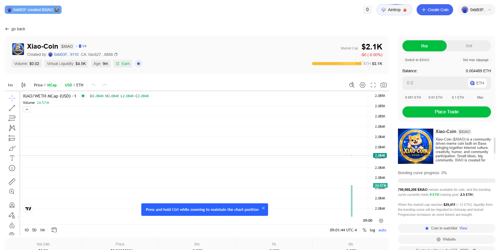

# Xiao-Coin launch snapshot

This is a historical launch snapshot, not live market data.

## Creator-provided screenshot

The screenshot was captured on 2026-09-11 at approximately nine minutes after
Xiao-Coin was created. It displayed:

| Field | Historical screenshot value |
|---|---:|
| Token | Xiao-Coin ($XIAO) |
| Market path | V4 |
| Tax | 0% |
| Market cap | approximately $2.1K |
| Displayed volume | $0.02 |
| Virtual liquidity | approximately $4.5K |
| Bonding-curve progress | 0% |
| XIAO remaining on curve | 799,988,208 XIAO |
| Collateral shown in curve | 0 ETH |
| Raising goal | 2.5 ETH |

The screenshot also displayed the shortened contract address `0xc627...8888`.
The canonical full address is:

`0xc62792b29E6aDbc179e47DAfCe159119bb918888`

## Data-freshness warning

Price, market cap, volume, holder count, virtual liquidity, remaining curve supply,
collateral, rewards, and progress can change after every transaction. Do not quote
these historical values as current. Use the official Base.meme page and BaseScan for
live information.
